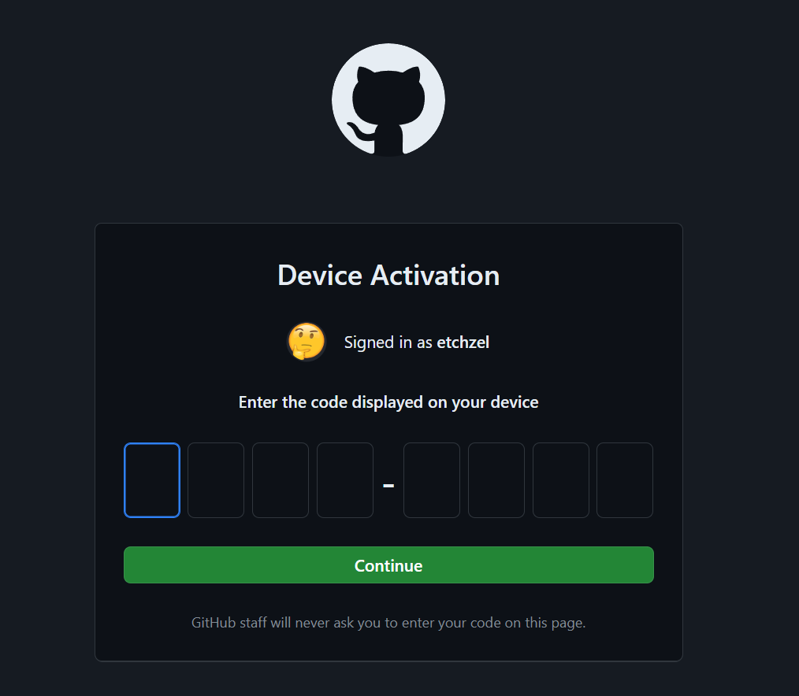

# Batch ML Inference using Google Cloud Dataflow

## Enable APIs (Don't show to Students)

- Dataflow API

  

  

- Cloud Vision API

  

  

- Vertex AI API

  

  

## Download Prerequisites

- Make sure git, github cli (gh) and wget is available in cloud shell

  ```bash
  # check git
  git --version

  # check github CLI
  gh --version

  # check wget
  wget --version
  ```

- If any of the above are not installed, install them with the following

  ```bash
  # install git
  sudo apt-get install git

  # install wget
  sudo apt-get install wget

  # install github cli
  type -p curl >/dev/null || (sudo apt-get update && sudo apt-get install curl -y)
  curl -fsSL https://cli.github.com/packages/githubcli-archive-keyring.gpg | sudo dd of=/usr/share/keyrings/githubcli-archive-keyring.gpg \
  && sudo chmod go+r /usr/share/keyrings/githubcli-archive-keyring.gpg \
  && echo "deb [arch=$(dpkg --print-architecture) signed-by=/usr/share/keyrings/githubcli-archive-keyring.gpg] https://cli.github.com/packages stable main" | sudo tee /etc/apt/sources.list.d/github-cli.list > /dev/null \
  && sudo apt-get update \
  && sudo apt-get install gh -y
  ```

- In cloud shell, download miniconda

  ```bash
  # create miniconda folder
  mkdir -p ~/miniconda3

  # download miniconda
  wget https://repo.anaconda.com/miniconda/Miniconda3-latest-Linux-x86_64.sh -O ~/miniconda3/miniconda.sh

  # run miniconda installer
  bash ~/miniconda3/miniconda.sh -b -u -p ~/miniconda3

  # delete installer
  rm -rf ~/miniconda3/miniconda.sh
  ```

  initialize conda by the following command, then reopen the shell

  ```bash
  # initialize conda
  ~/miniconda3/bin/conda init bash

  # exit shell
  exit
  ```

- Once miniconda is installed, create an env and enter `Y` when prompted

  ```bash
  # create conda env
  conda create -n dataflow-env python=3.11
  ```

  Once env is created, install the required library

  ```bash
  # activate conda env
  conda activate dataflow-env

  # install apache beam
  pip install apache-beam[gcp]==2.53.0

  # install opencv
  pip install opencv-python-headless==4.9.0.80
  ```

  Verify the following packages are installed

  ```bash
  # check cloud vision is installed
  pip show google-cloud-vision

  # check cloud storage is installed
  pip show google-cloud-storage

  # check apache beam is installed
  pip show apache-beam

  # check opencv is installed
  pip show opencv-python-headless
  ```

- Authenticate with Github CLI:

  ```bash
  gh auth login
  ```

- You will be getting some prompts

  

  

  

  

  

- Open the URL from the prompt on your browser and enter the OTP code

  

- Next clone the git repo:

  ```bash
  # clone repo
  git clone https://github.com/etchzel/dataflow-ml-inference.git

  # change directory to cloned repo
  cd dataflow-ml-inference
  ```

- Finally, build the template for the dataflow

  ```bash
  python main.py \
    --project=engineering-training-413102 \
    --region=asia-southeast2 \
    --template_location=gs://trainer_gcs_001/dataflow/templates/batch-online-predict.json \
    --staging_location=gs://trainer_gcs_001/dataflow/staging \
    --temp_location=gs://trainer_gcs_001/dataflow/temp
  ```

- Template will be available on GCS folder:

  ```bash
  gs://trainer_gcs_001/dataflow/templates/batch-online-predict.json
  ```

## Run Dataflow Job

- Make sure there are some images in the folder `image_001`

- Go to dataflow page from Google Cloud Console:

  

  

- On the main page, click on `CREATE JOB FROM TEMPLATE`

  

  Choose `asia-southeast2` for Regional endpoint

  

  Next click on the empty `Dataflow template` field, choose `Custom Template`

  

  In the empty template path, fill in the template path from the previous step

  

  In the `Additional parameters` segment, click on `ADD PARAMETER`

  

  Fill the key and values like below

  

  Where `bucket_name` is the bucket you want to read and write the images from, and `prefix` is the folder to read the images from.

- Click `Run Job`

  
