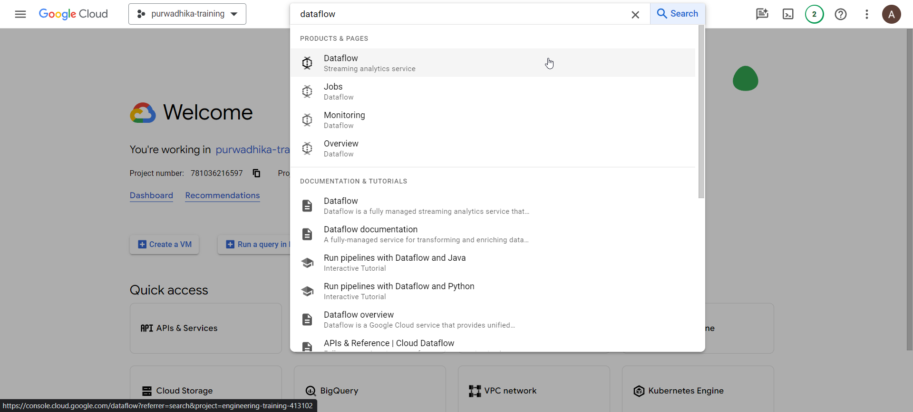

# Batch ML Inference using Google Cloud Dataflow

## Enable APIs (Don't show to Students)

- Dataflow API

  

  

- Cloud Vision API

  

  

- Vertex AI API

  

  

## Download Prerequisites

- Make sure git and wget is available in cloud shell

  ```bash
  git --version
  wget --version
  ```

- In cloud shell, download miniconda

  ```bash
  mkdir -p ~/miniconda3
  wget https://repo.anaconda.com/miniconda/Miniconda3-latest-Linux-x86_64.sh -O ~/miniconda3/miniconda.sh
  bash ~/miniconda3/miniconda.sh -b -u -p ~/miniconda3
  rm -rf ~/miniconda3/miniconda.sh
  ```

  initialize conda by the following command, then reopen the shell

  ```bash
  ~/miniconda3/bin/conda init bash
  exit
  ```

- Once miniconda is installed, create an env and enter `Y` when prompted

  ```bash
  conda create -n dataflow-env python=3.11
  ```

  Once env is created, install the required library

  ```bash
  conda activate dataflow-env
  pip install apache-beam[gcp]==2.53.0
  pip install opencv-python-headless==4.9.0.80
  ```

  Verify the following packages are installed

  ```bash
  pip show google-cloud-vision
  pip show google-cloud-storage
  pip show apache-beam
  pip show opencv-python-headless
  ```

- Next clone the git repo:

  ```bash
  git clone https://<personal-access-token>@github.com/etchzel/dataflow-ml-inference.git
  cd dataflow-ml-inference
  ```

- Finally, build the template for the dataflow

  ```bash
  python main.py \
    --project=engineering-training-413102 \
    --region=asia-southeast2 \
    --template_location=gs://trainer_gcs_001/dataflow/templates/batch-online-predict.json \
    --staging_location=gs://trainer_gcs_001/dataflow/staging \
    --temp_location=gs://trainer_gcs_001/dataflow/temp
  ```

- Template will be available on GCS folder:

  ```bash
  gs://trainer_gcs_001/dataflow/templates/batch-online-predict.json
  ```

## Run Dataflow Job

- Make sure there are some images in the folder `image_001`

- Go to dataflow page from Google Cloud Console:

  

  

- On the main page, click on `CREATE JOB FROM TEMPLATE`

  

  Choose `asia-southeast2` for Regional endpoint

  

  Next click on the empty `Dataflow template` field, choose `Custom Template`

  

  In the empty template path, fill in the template path from the previous step

  

  In the `Additional parameters` segment, click on `ADD PARAMETER`

  

  Fill the key and values like below

  

  Where `bucket_name` is the bucket you want to read and write the images from, and `prefix` is the folder to read the images from.

- Click `Run Job`

  
